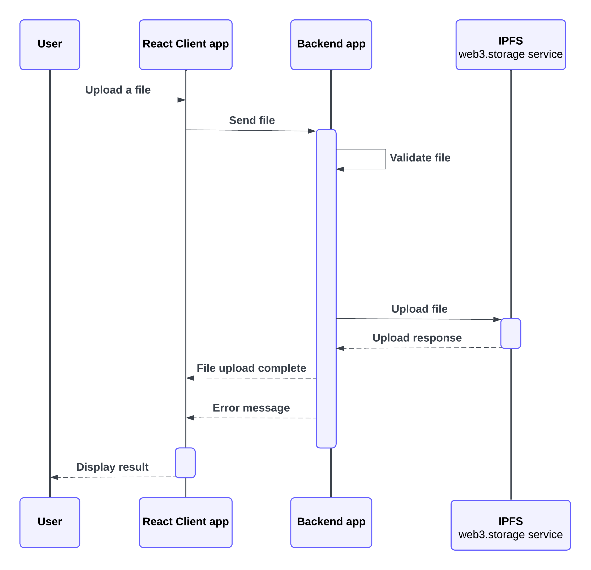
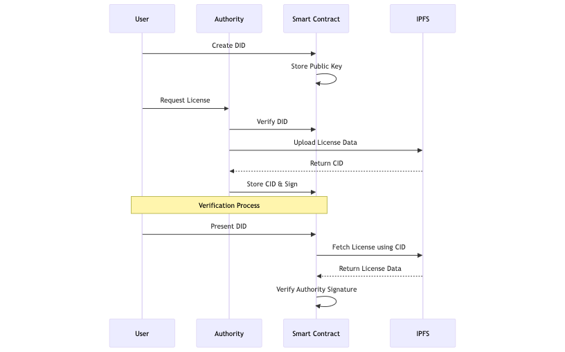
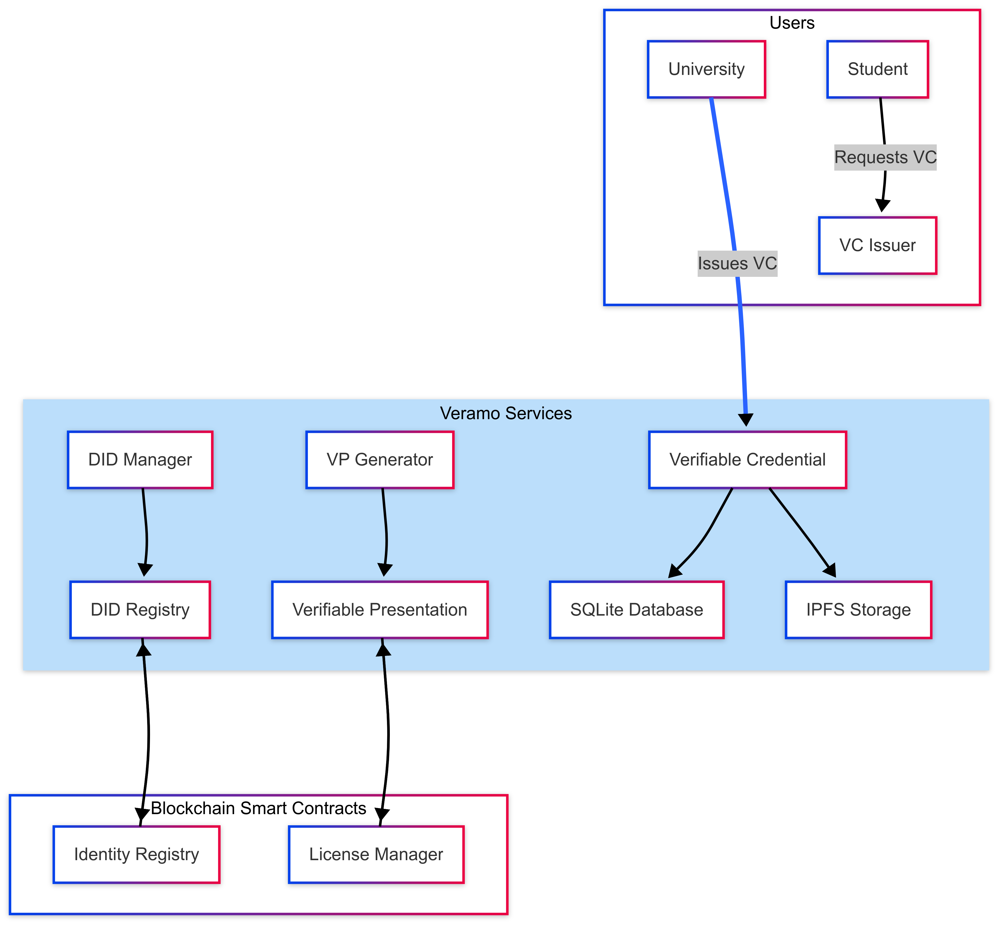

# ProofMINT :rocket:
A blockchain app for decentralized certificate verification.


## Table of Contents
- [Getting Started](#getting-started)
  - [Prerequisites](#prerequisites)
  - [Installing](#installing)
  - [Diagrams](#diagrams)
- [Authors](#authors)

## Getting Started
### Prerequisites   
- Node.js
- npm
- Hardhat
- Metamask
- Infura
- Web3.storage
- React

### Installing
- Clone the repository
- Install the dependencies
```
npm install
```
- Make sure to change .env variables. Look into .env.example for reference.
```
# EAS
EAS_CONTRACT_ADDRESS=
EAS_SCHEMA_UID=
EAS_SCHEMA_REGISTRY_ADDRESS=

# CUSTOM CONTRACTS
LICENSE_RESOLVER_CONTRACT_ADDRESS=

# SEPOLIA
SEPOLIA_RPC_URL=
INFURA_API_KEY=

# WALLET
EAS_ATTESTATION_RECIPIENT=
PRIVATE_KEY=

# WEB3 STORAGE 
KEY=
PROOF=
```
- Run the app with        
```
npm start
```

- In another terminal run the server.js
```
node server.js
```

- Compile the contracts
```
npx hardhat compile
```
- Deploy the contract
```
npx hardhat run scripts/deploy-contract-name.js --network sepolia
```

- Run the tests
```
npx hardhat test
```

### Diagrams
#### The process of uploading a file to IPFS:

#### The workflow of the app:


#### SSI concept diagram:


## Authors
- Macovei Catalina 